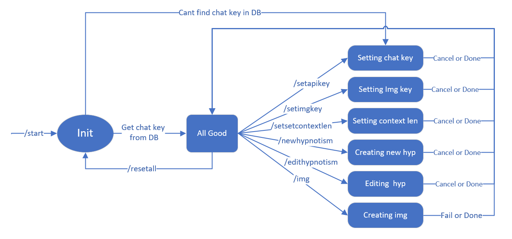

# TelegramChatBot
- This is a chatbot powered by OpenAI GPT API, which you can easily hypnotize into a specified character with simply one click. Using the latest 'system' parameter, It can effectively avoid forgetting the character settings during chatting. You can also conveniently manage and create new hypnosis spells. With a variety of powerful APIs, the chatbot has multimodal interaction capabilities including image display, voice input and output, and more. The API used include

  - **Text generation**: [gpt-3.5-turbo](https://platform.openai.com/docs/guides/text-generation) & [gpt-4](https://platform.openai.com/docs/guides/text-generation)
  - **Image generation**: [stable-diffusion-xl-1024-v1-0](https://dreamstudio.com/api/)
  - **Text-to-voice**: [tts-1](https://platform.openai.com/docs/guides/text-to-speech)

  - **Voice-to-text**: [whisper-1](https://platform.openai.com/docs/guides/speech-to-text)

- If you want to deploy this bot, Don't forget to message [@BotFather](https://t.me/botfather) on Telegram to register your bot and receive its authentication token. Check https://core.telegram.org/bots#how-do-i-create-a-bot for more information.

- Try it right now by [@jokerController_bot ](https://t.me/jokerController_bot ) on Telegram !


## Setup

1. Create a new virtual environment with python 3.10, here is an example with anaconda

   ```shell
   conda create -n ChatBot python=3.10
   ```

2. Activate the virtual environment in anaconda

   ```shell
   activate ChatBot
   ```

3. Make sure you are in the project path, install all requirement lib by 

   ```shell
   pip install -r requirements.txt
   ```

   If the download process is too slow, Tsinghua Mirror source is recommended

   ```shell
   pip install -r requirements.txt -i https://pypi.tuna.tsinghua.edu.cn/simple
   ```
4. Install [ffmpeg](https://ffmpeg.org/download.html)

5. Install [MySQL 5.7](https://www.mysql.com/)


## State Machine




----------------

搞科研就是遇到问题摸大鱼啦~~

